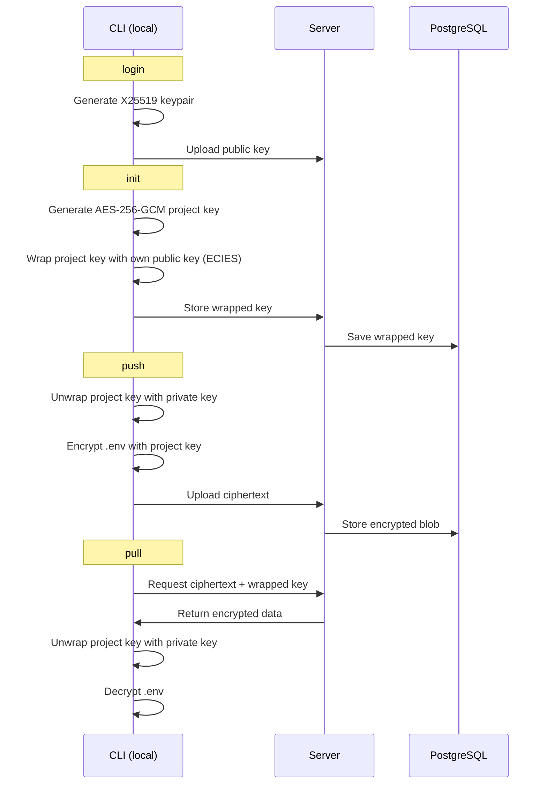

# env-share

Self-hosted encrypted `.env` sharing. End-to-end encrypted — the server cannot decrypt your secrets even with full database access.

## Deploy

1. Create a [GitHub OAuth App](https://github.com/settings/developers) (enable Device Flow)
2. Copy `.env.example` and fill in your values:

```bash
cp .env.example .env
```

3. Start with Docker Compose:

```bash
docker compose up -d
```

## CLI Usage

```bash
# Authenticate
npx @infomiho/env-share login --server https://env.example.com

# Initialize a project
npx @infomiho/env-share init

# Push / pull .env files
npx @infomiho/env-share push
npx @infomiho/env-share pull

# Manage files
npx @infomiho/env-share files list
npx @infomiho/env-share files history .env
npx @infomiho/env-share files delete .env.old

# Manage team members
npx @infomiho/env-share members add octocat
npx @infomiho/env-share members remove octocat
npx @infomiho/env-share members list
```

## How It Works

1. On `login`, the CLI generates an X25519 keypair. The private key stays on your machine; the public key is uploaded to the server.
2. On `init`, a random AES-256-GCM project key is created and wrapped (encrypted) with your public key using ECIES.
3. On `members add`, the project key is unwrapped with your private key, then re-wrapped with the new member's public key.
4. On `push`, the CLI encrypts `.env` files with the project key and uploads the ciphertext. Each push is stored as a new version.
5. On `pull`, the CLI downloads the ciphertext, unwraps the project key, and decrypts locally.



The server only ever sees encrypted blobs and wrapped keys — it can never decrypt anything.
